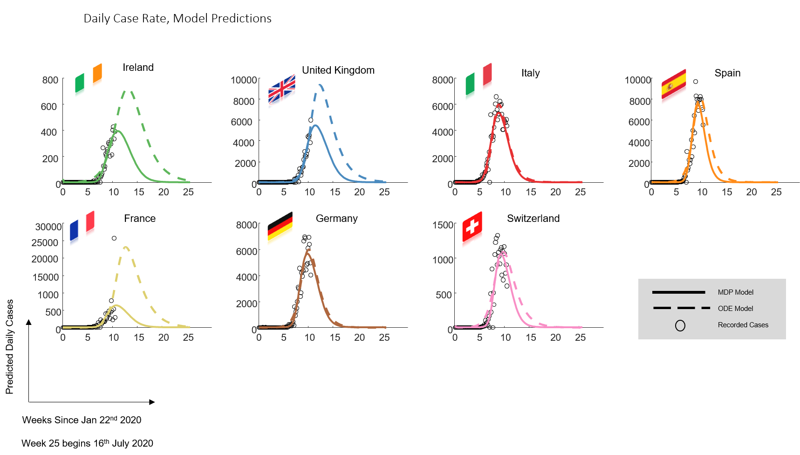

# Estimating required ‘lockdown’ cycles before immunity to SARS-CoV-2: Model-based analyses of susceptible population sizes, ‘S0’, in seven European countries including the UK and Ireland 

By Rosalyn J. Moran, Erik D. Fagerholm, Maell Cullen, Jean Daunizeau, Mark P. Richardson, Steven Williams, Federico Turkheimer, Rob Leech, Karl J. Friston

*Model predictions of daily reported case rates across countries. 

## Methods & Results

We used Bayesian model inversion to estimate epidemic parameters from the reported case and death rates from seven countries using data from late January 2020 to April 5th 2020. Two distinct generative model types were employed: first a continuous time dynamical-systems implementation of a Susceptible-Exposed-Infectious-Recovered (SEIR) model and second: a partially observable Markov Decision Process (MDP) implementation of an SEIR model. Both models parameterise the size of the initial susceptible population (‘S0’), as well as epidemic parameters. Parameter estimation (‘data fitting’) was performed using an established variational Bayesian scheme designed to allow for latent unobservable states and uncertainty in model parameters. 

Both models recapitulated the dynamics of transmissions and disease as given by case and death rates. The peaks of the current waves were predicted to be in the past for four countries (Italy, Spain, Germany and Switzerland) and to emerge in 0.5 – 2 weeks in Ireland and 1-3 weeks in the UK. For France one model estimated the peak within the past week and the other in the future in two weeks. Critically, Maximum a posteriori (MAP) estimates of S0 for each country indicated effective pandemic populations of below 20% from both the continuous time and MDP models.  Using a Bayesian weighted average across all seven countries and both models, we estimated that 6.4% of the population would be immune. From the two models the maximum percentage of the population in the current epidemic ‘meta populations’ was estimated at 19.6% of the population for the UK, 16.7% for Ireland, 11.4% for Italy, 12.8% for Spain, 18.8% for France, 4.7% for Germany and 12.9% for Switzerland.

## Software implementation

Code used to generate the results and figures in the paper are in
the `scripts` folder.

SPM12 is required to reproduce these results.
